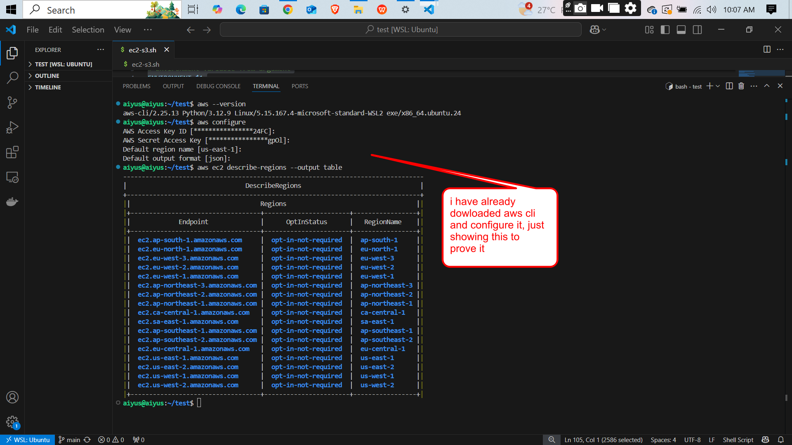

````markdown
# AWS CLI & API Project Documentation

## Overview

This project documents my understanding and practical experience using the **AWS CLI**, interacting with **AWS APIs**, and **authenticating to AWS services via the terminal**. It is intended to demonstrate basic proficiency in programmatically managing AWS resources using command-line tools.

---

## 🔧 AWS CLI Setup

To begin, I installed and configured the AWS CLI on my local machine.

### Installation (Ubuntu)
```bash
sudo apt update
sudo apt install awscli -y
````

### Configuration

```bash
aws configure
```

**Prompted values:**

* AWS Access Key ID: `****************ABCD`
* AWS Secret Access Key: `****************1234`
* Default region: `us-east-1`
* Output format: `json`

---


## ✅ Summary

This project helped me:

* Understand AWS CLI configuration and authentication.
* Practice making API requests from the terminal.
* Gain confidence in managing AWS infrastructure without using the console.

---


## screen shot

